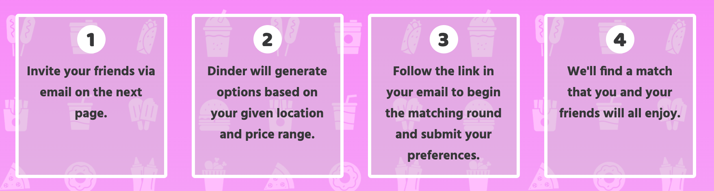

# Dinder Party 
A group decision making app that answers: where should we get dinner tonight?	We'll find a restaurant option that you and your friends can all agree on, so you can circumvent the annoying 3 hour round-and-round of indecision. 

## How it Works
Step 1: Host initiates a Dinder Party by choosing a cuisine and a neighborhood, and inviting their friends to join via Email 
Step 2: Dinder sends an email to each participant, including the host, with a unique access code and link to the matching round 
Step 3: In the matching round, participants are presented with 10 options, based on the Host's criteria, and 'swipe' left or right to either reject or approve each option, respectively 
Step 4: Based on each participant's preferences, Dinder will pick an option that 100% of the group has approved of, and email everyone again to announce the winning restaurant 

## How it Works, Technically 
Once the host enters their cuisine and location preferences, in addition to valid email addresses, the frontend React component utilizes Axios to send multiple HTTP POST requests to the backend Express framework, creating a new session, as well as records for each of the participants in the dinder party. With the help of Nodemailer, an email is then sent to all participants, informing them that they have been invited to the dinder party. This email contains a link to their swiping session on the dinderparty website and a unique verification code linking a specific user to a specific party, which is to be entered before they begin swiping. Once validated, this user is shown the ten restaurant options (pulled from the Yelp API at the time of creation) as cards that they can approve or reject, based on the descriptions provided. They can also click the name of the restaurant to be taken to the Yelp page for that restaurant. The app records when each participant has completed their swiping session, and when the last participant submits, the real magic of this app unfolds. The dinder app aggregates the approved and rejected restaurants from all participants and decides from the mutually agreed-upon restaurants which one they should go to. Once locked in, a follow-up email is sent to all participants with the winning restaurant and another link to Yelp to get more details and make their reservation.

## Technologies 
### MERN Stack
Dinder is built with a MongoDb database framework on the backend, Express application controller, React components on the frontend, and a Node.js server. Dinder is deployed on Heroku.  

### NodeMailer.js
We imported a module called NodeMailer to support our in-app email needs. NodeMailer is configured with two custom templates: one for the initial invitation to match, and one to announce the winning restaurant. NodeMailer is configured with handlebars templates and custom mail options for variables including session codes, links, attachments, and styling.  

### Yelp API Integration
We integrated the Yelp API to pull restaurant options based on user-inputted search criteria. When initializing a dinder party, a host can optionally include a cuisine search term and a geographical search term, to narrow down the list of options Dinder presents to their group. Using these search terms, we request a list of the top 10 reviewed restaurant options from Yelp.  

### 'Swiping' Functionality 
The 'swiping' functionality was achieved using a combination of JavaScript, HTML, and CSS.  

## Future Plans
1) If no restaurant option is agreed upon by every group participant, Dinder will auto-initialize a new round with 10 new options.  
2) If not every participant has completed their matching round within 1 hour of initialization, Dinder will close the round and pick a winner.  
3) Allow for more than 5 participants.

